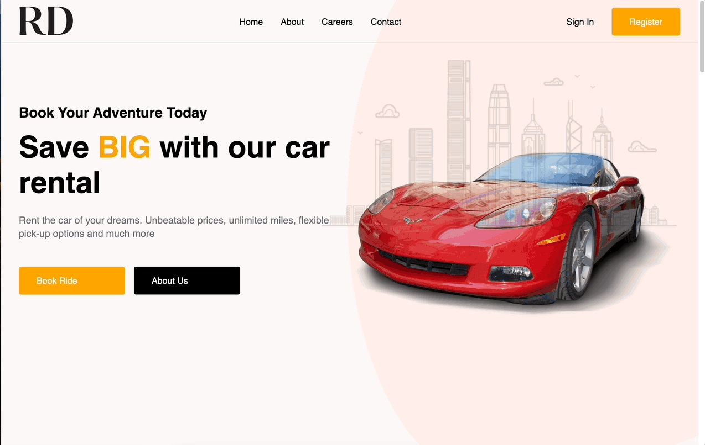

<h1 align='center'>
  RoyalDrive Car Rental
</h1>

<h2>Description</h2>

Royal Drive is a sophisticated web application for luxury car rentals, designed with React and SCSS. Our platform features an array of premium vehicles, complete with detailed descriptions and a user-friendly interface. 

<h2>Landing Page</h2>
</img>


Beyond just a landing page, it includes several sections like careers, about us, contact, and user account management. 
  
</img>


The application also have a mobile-responsive design highlights the seamless user interface and functionality on smaller screens.
  
</img>

## Installation
<a id='install'></a>

1. Clone the repo
```
git clone https://github.com/KenMain5/Calidrive-Car-Rental.git
```
2. Install NPM packages
```
npm install
```
3. Run the application
```
npm start
```


